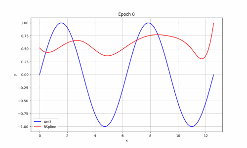
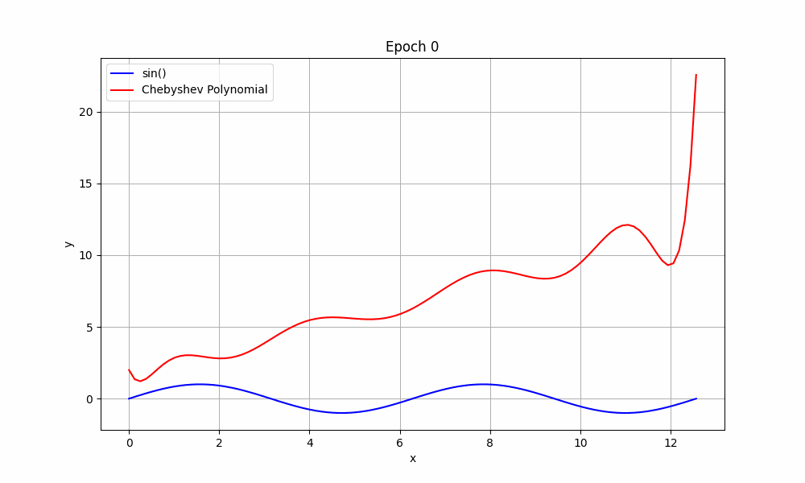

# kamo 🔥

Kolmogorov-Arnold Networks in Mojo

My personal journey into learning about [KAN](https://github.com/KindXiaoming/pykan)s using [Mojo](https://docs.modular.com/mojo/manual/).
Starting with the new kid on the block—edges with optimizable functions—I'll be piecing
together everything needed for KANs, step by step. 
For now, the focus is on understanding the concepts rather than optimizing for performance.

## Empowering Edges

| **B-Spline** | **Chebyshev** |
|--------------|--------------|
|  |  |

## Changelog

- 2024.06.04
  - Performance optimization edge functions. 
- 2024.06.03
  - Implementation of edge functions (BSplineSilu and Chebyshev Polynoms)
  - Edge training examples
  
- 2024.06.02
  - Initial Commit

## License

MIT