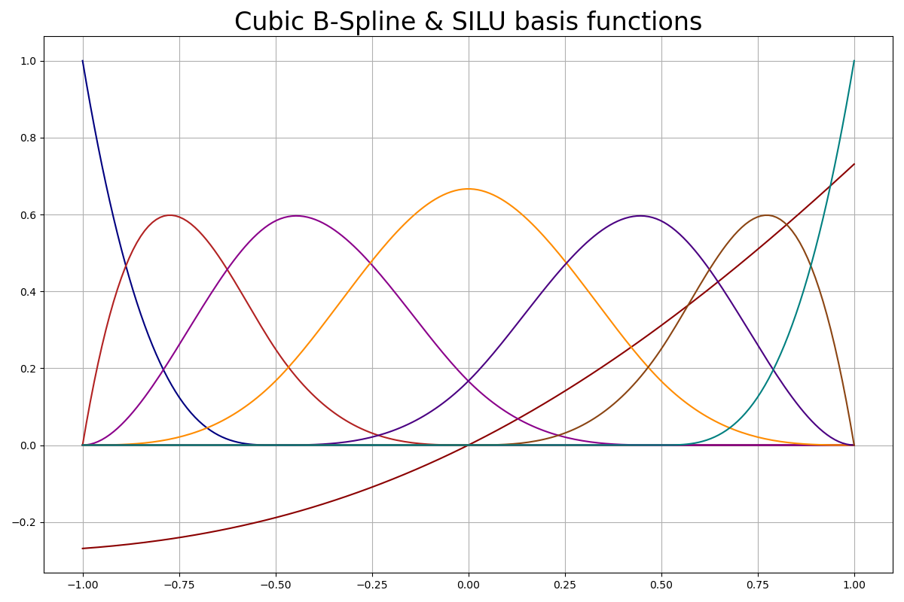
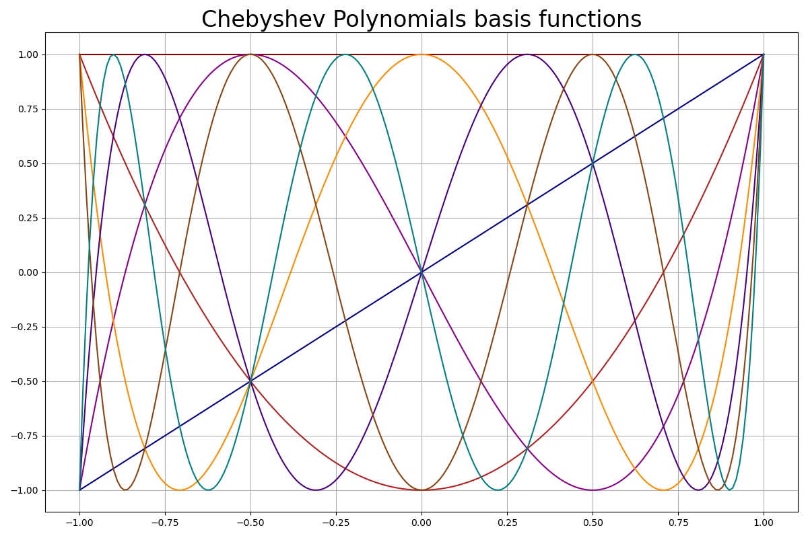
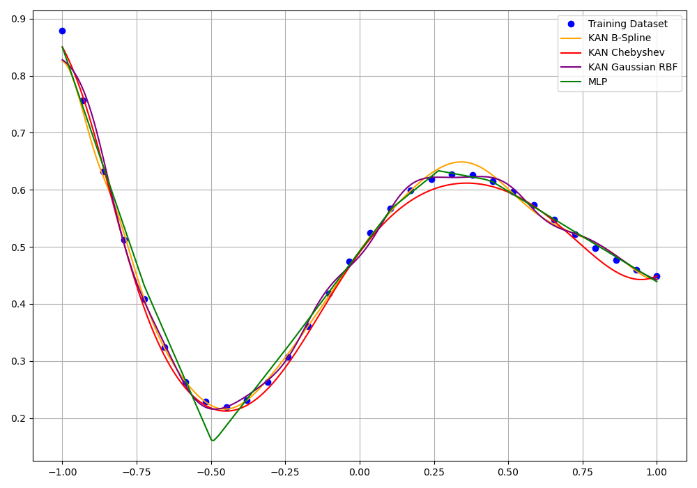
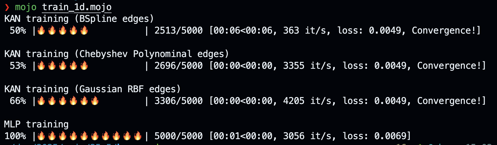
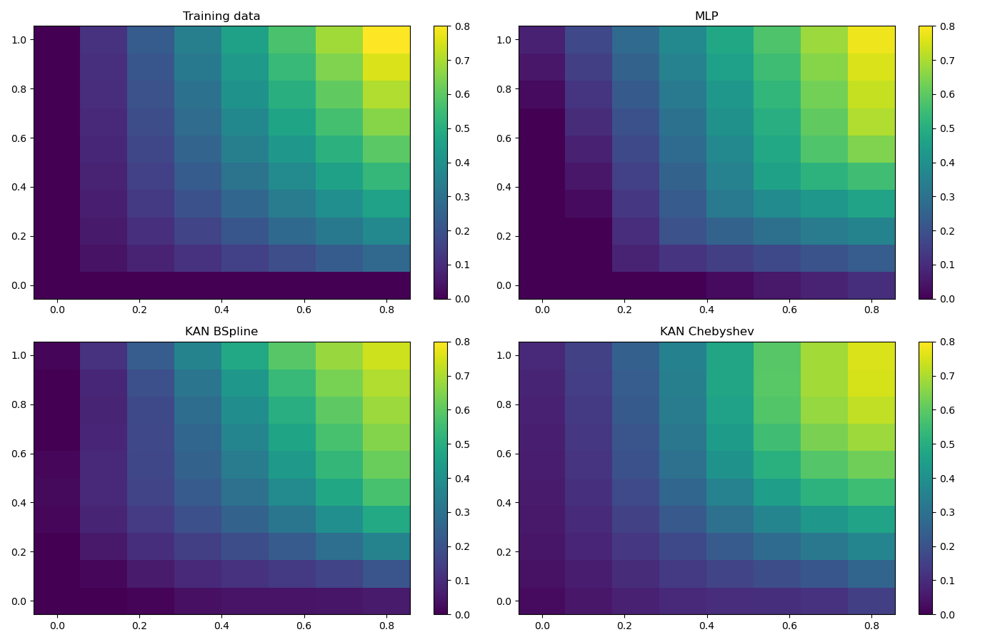
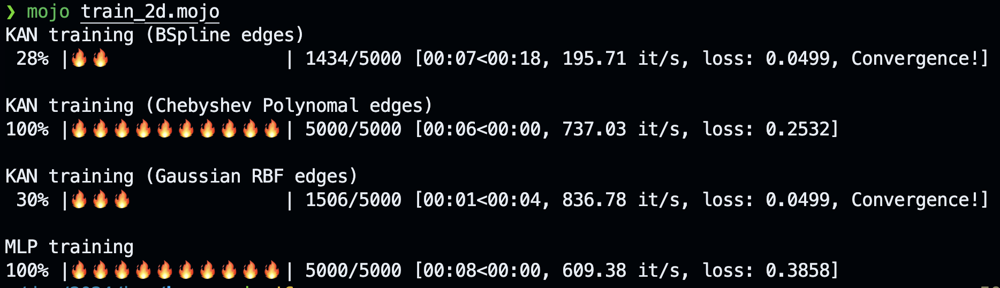

# kamo 🔥

A personal journey into learning about _Kolmogorov–Arnold Networks_ using [Mojo](https://docs.modular.com/mojo/manual/).

The following excerpt from the abstract the paper [KAN: Kolmogorov-Arnold Networks](https://arxiv.org/abs/2404.19756) provides the foundational inspiration:

> Inspired by the Kolmogorov-Arnold representation theorem, we propose Kolmogorov- Arnold Networks (KANs) as promising alternatives to Multi-Layer Perceptrons (MLPs). While MLPs have fixed activation functions on nodes (“neurons”), KANs have learnable activation functions on edges (“weights”). KANs have no linear weights at all – every weight parameter is replaced by a univariate function parametrized as a spline. We show that this seemingly simple change makes KANs outperform MLPs in terms of accuracy and interpretability.

This repository explores KANs by porting the KAN Python implementation from [ML without tears](https://mlwithouttears.com/2024/05/15/a-from-scratch-implementation-of-kolmogorov-arnold-networks-kan/) to Mojo. This excellent Python implementation provides a flexible foundation, enabling instantiation as either a KAN or a classic MLP, which allows for various comparisons and experiments. The main focus is on understanding the fundamental concepts rather than on optimizing performance or implementing all aspects of KANs.

## Empowering edges

The fundamental innovation of KANs lies in their learnable activation functions on edges. The paper [KAN: Kolmogorov-Arnold Networks](https://arxiv.org/abs/2404.19756) suggests using a linear combination of B-Splines and the SiLU function. Subsequent research also recommends the use of Chebyshev polynomials. These sets of renowned basis functions from approximation theory are not only powerful but also elegant in their mathematical beauty.

| **B-Spline** | **Chebyshev** |
|--------------|--------------|
|  |  |

## Usage

The [ML without tears](https://mlwithouttears.com/2024/05/15/a-from-scratch-implementation-of-kolmogorov-arnold-networks-kan/) implementation offers some basic usage examples to get started. We ported the first two of them.

### 1D regression problem

Refer to [train_1d.mojo](train_1d.mojo) for a simple 1D regression problem. This example compares the performance of a classical MLP with two KAN networks: one utilizing B-Spline-based edges and the other using Chebyshev polynomial-based edges.

Performance:

### 2D regression problem

[train_2d.mojo](train_2d.mojo) implements a 2D regression problem. We compare again the performance of a classical MLP with two KAN networks: B-Spline-based and Chebyshev polynomial-based edges.

Performance:

## Remarks

- The current implementation covers only the basic KAN concepts. The paper [KAN: Kolmogorov-Arnold Networks](https://arxiv.org/abs/2404.19756) suggests various ways to enhance KANs, such as sparsification and grid extension, which have inspired extensive follow-up research. There is plenty of room for improvement in our implementation.
- Additional basis functions for edges have been proposed, such as Gaussian Radial Basis Functions, as seen in [FastKAN](https://github.com/ZiyaoLi/fast-kan). We plan to add these and other basis functions to this repository.
- While each edge in a KAN layer has individual weights, the basis functions are evaluated for each edge using the same input values from the previous layer. These values can be effectively cached, resulting in approximately a 50% speedup. We have enabled this caching by default using the `PHI_CACHING` parameter.
- For simplicity, we use `tanh` to normalize the edge inputs to the range of spline grids. This technique is widely used by other performance-optimized KAN implementations (see, for example, [FasterKAN](https://github.com/AthanasiosDelis/faster-kan)).
- Neither the Python implementation nor our code are optimized for speed, so we won't be conducting benchmark tests at this stage. However, as a rough estimate, our Mojo implementation is approximately twice as fast as the Python version on our machine.

## Resources

- The GitHub repository associated with the above referenced paper can be found here: [pykan](https://github.com/KindXiaoming/pykan).
- [Awesome KAN](https://github.com/mintisan/awesome-kan) A curated list of awesome libraries, projects, tutorials, papers, and other resources related to Kolmogorov-Arnold Network (KAN).

## Changelog
  
- 2024.06.13
  - Initial Commit version 2

## License

MIT
