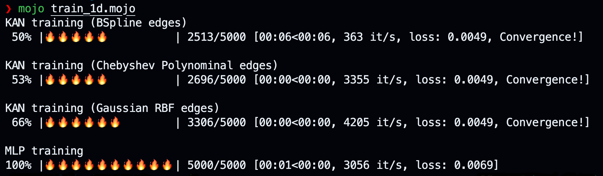
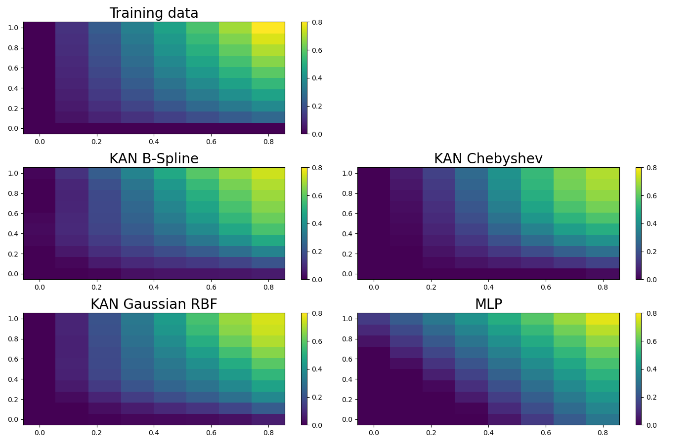
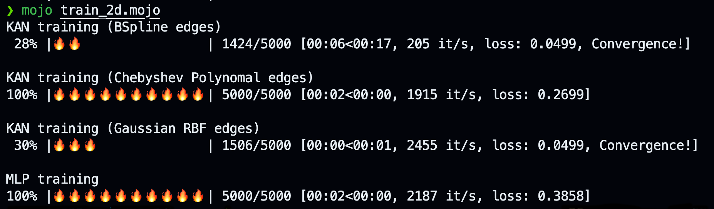

# kamo 🔥

A personal journey into learning about _Kolmogorov–Arnold Networks_ using [Mojo](https://docs.modular.com/mojo/manual/).

The following excerpt from the abstract of the paper [KAN: Kolmogorov-Arnold Networks](https://arxiv.org/abs/2404.19756) provides the essential inspiration:

> Inspired by the Kolmogorov-Arnold representation theorem, we propose Kolmogorov- Arnold Networks (KANs) as promising alternatives to Multi-Layer Perceptrons (MLPs). While MLPs have fixed activation functions on nodes (“neurons”), KANs have learnable activation functions on edges (“weights”). KANs have no linear weights at all – every weight parameter is replaced by a univariate function parametrized as a spline. We show that this seemingly simple change makes KANs outperform MLPs in terms of accuracy and interpretability.

This repository explores KANs by porting the KAN Python implementation from [ML without tears](https://mlwithouttears.com/2024/05/15/a-from-scratch-implementation-of-kolmogorov-arnold-networks-kan/) to Mojo. This very readable Python implementation provides a flexible foundation, enabling instantiation as either a KAN or a classic MLP, which allows for various comparisons and experiments. The main focus is on understanding the core concepts rather than on optimizing performance or implementing all aspects of KANs.

## Empowering edges

The fundamental innovation of KANs lies in their learnable activation functions on edges. The paper [KAN: Kolmogorov-Arnold Networks](https://arxiv.org/abs/2404.19756) suggests using a linear combination of B-Splines and the SILU function. Subsequent research also recommends the use of Chebyshev polynomials among others. One key feature of these functions is that their derivatives are well defined and easy to calculate, which is crucial for gradient descent optimization.

| **Basis Functions** | **Derivatives** |
|--------------------|----------------|
| **B-Splines & SILU**       |                |
|  |  |
| **Chebyshev Polynominals**      |                |
|  |  |
| **Gaussian RBF**   |                |
|  |  |

## Usage

**Prerequisite**:

* Ensure that the `Magic` command line tool is installed by following the [Modular Docs](https://docs.modular.com/magic).
* Run `magic shell` within the root of the cloned repository to install the project's dependencies (Mojo 24.5 via Max, Matplotlib), and to activate the project's virtual environment in which you can run the mojo apps.

The [ML without tears](https://mlwithouttears.com/2024/05/15/a-from-scratch-implementation-of-kolmogorov-arnold-networks-kan/) implementation offers some basic usage examples to get started. We ported the first two of them to [Mojo](https://docs.modular.com/mojo/).

### 1D regression problem

Refer to [train_1d.mojo](train_1d.mojo) for a simple 1D regression problem. This example compares the performance of a classical MLP with three KAN networks: one utilizing B-Spline-based edges, another using Chebyshev polynomial-based edges, and the third employing Gaussian RBF-based edges.

Performance:

### 2D regression problem

[train_2d.mojo](train_2d.mojo) implements a 2D regression problem. We compare again the performance of a classical MLP with three KAN networks: B-Spline-based, Chebyshev polynomial-based, and Gaussian RBF-based edges

Performance:

## Just Learning

Currently, this project is for our own educational purposes, with no immediate plans to make it suitable for real-world applications. Similar to the original Python code, this KAN implementation prioritizes network transparency over speed. If you're looking for a Mojo deep learning framework with competitive performance features, check out [Basalt](https://github.com/basalt-org/basalt) and [Endia](https://github.com/endia-org/Endia).

## Remarks

* The current implementation covers only the basic KAN concepts. The paper [KAN: Kolmogorov-Arnold Networks](https://arxiv.org/abs/2404.19756) suggests various ways to enhance KANs, such as sparsification and grid extension, and has inspired extensive follow-up research. There is plenty of room for improvement in our implementation.
* For simplicity, we use `tanh` to normalize the edge inputs to the range of spline grids. This technique is widely used by other performance-optimized KAN implementations (see, for example, [FasterKAN](https://github.com/AthanasiosDelis/faster-kan)).
* Mojo is evolving quickly but is still quite young and limited in some aspects, such as full support for dynamic polymorphism. Some of the boilerplate in our code is due to these limitations. We're looking forward to improve our implementation as Mojo continues to mature.

## Resources

* The GitHub repository associated with the above referenced paper can be found here: [pykan](https://github.com/KindXiaoming/pykan).
* [Awesome KAN](https://github.com/mintisan/awesome-kan) A curated list of awesome libraries, projects, tutorials, papers, and other resources related to Kolmogorov-Arnold Network (KAN).

## Changelog

* 2024.09.17
  * Updated to Mojo 24.5
* 2024.06.14
  * Added Gaussian Radial Basis Functions (inspired by [FastKAN](https://github.com/ZiyaoLi/fast-kan))
* 2024.06.13
  * Initial commit version 2

## License

MIT
